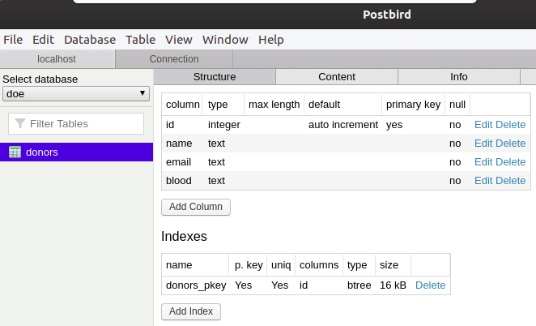

<h1 align="center">
<br>
  
<br>
<br>
DOE SANGUE
</h1>

<p align="center">Doe Sangue é uma sistema para o cadastro de doadores de sangue desenvolvido durante os dias 18 e 19 de fevereiro de 2020 em um evento online e totalmente gratuito denominado MaratonaDev organizado pela <a href="https://rocketseat.com.br">Rocketseat</a>. </p>

<p align="center">
  <a href="https://opensource.org/licenses/MIT">
    
  </a>
</p>

<div>
  
</div>

## Features
Esta aplicatição apresenta todas as mais recentes ferramentas e práticas em desenvolvimento!

- 💹 [**Node Js**](https://nodejs.org/en/)
- [HTML+CSS+JAVASCRIPT](https://www.w3schools.com)
- [Express](https://expressjs.com/)
- [PostgreSQL](https://www.postgresql.org/)
- [DotEnv](https://www.npmjs.com/package/dotenv)
- [Nunjucks](https://mozilla.github.io/nunjucks/)

## Getting started

Para clonar esta aplicação é necessário o [Git](https://git-scm.com/downloads).

```sh
# Clone o projeto
$ git clone https://github.com/wendhio/doe-sangue.git

# Entre no repositório
$ cd doe-sangue

# Instale as dependências
$ npm install

# Inicie o servidor
$ npm start
```

Para salvar os dados é necessário criar o banco de dados com o [PostgreSQL](https://www.postgresql.org/)



Configurar a conexão com o banco de dados

```
# Crie um arquivo .env e edite as configurações do banco de dados
DB_USER=
DB_PASSWORD=
DB_HOST=
DB_PORT=5432
DB_DATABASE=doe
```

## License

This project is licensed under the MIT License - see the [LICENSE](https://opensource.org/licenses/MIT) page for details.
